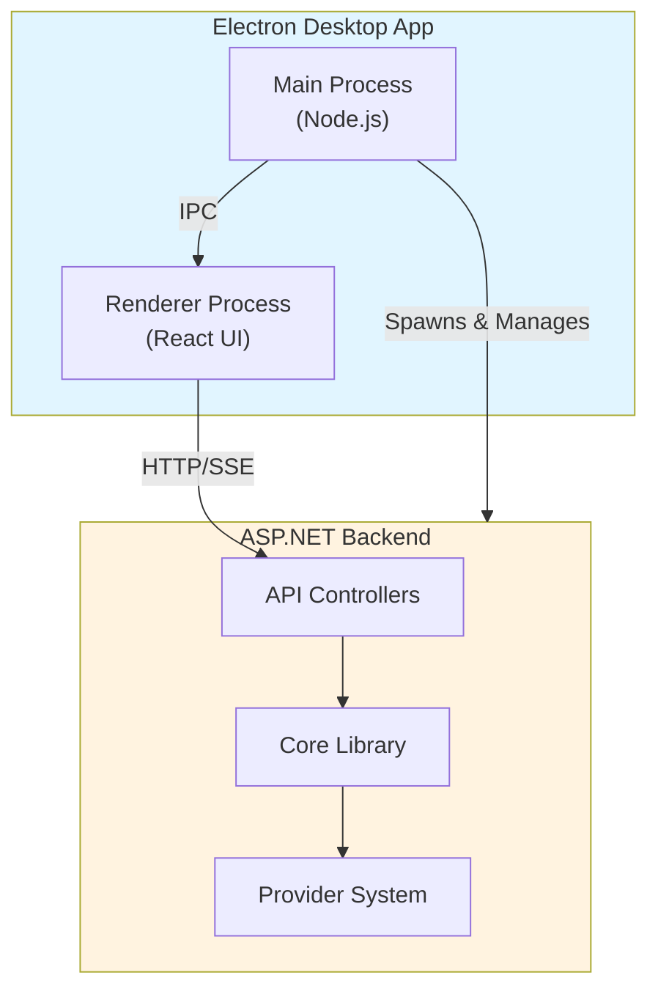
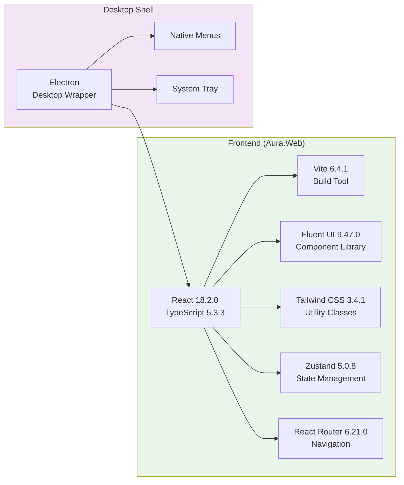
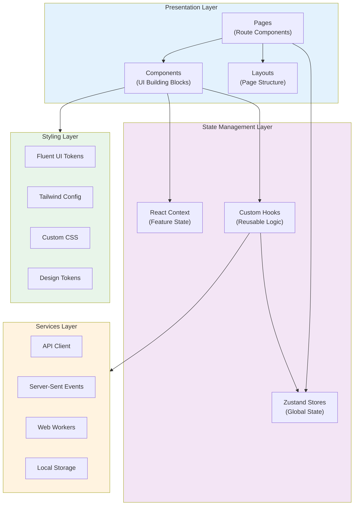
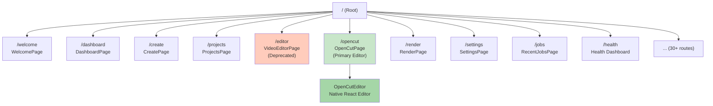
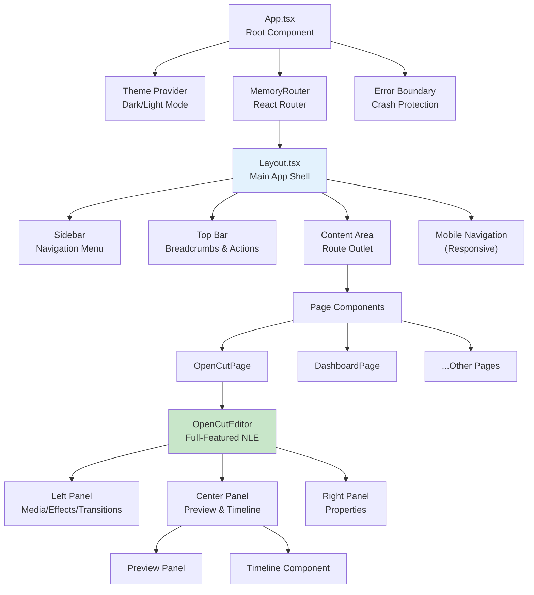
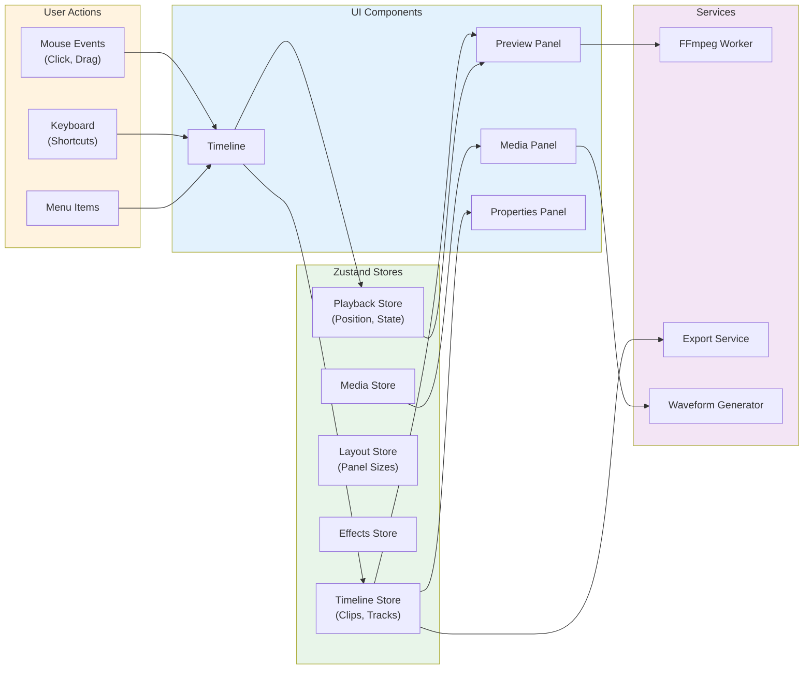

# Aura Video Studio - UX Audit and Enhancement Plan

**Document Version:** 1.0  
**Created:** December 2024  
**Status:** Active Development  

---

## Table of Contents

1. [Executive Summary](#executive-summary)
2. [Application Architecture](#application-architecture)
3. [UI Structure Analysis](#ui-structure-analysis)
4. [Current State Assessment](#current-state-assessment)
5. [Design System Proposal](#design-system-proposal)
6. [Implementation Roadmap](#implementation-roadmap)
7. [Technical Specifications](#technical-specifications)
8. [Before/After Tracking](#beforeafter-tracking)

---

## Executive Summary

### Purpose

This document provides a comprehensive audit of Aura Video Studio's current UI/UX implementation and outlines a systematic plan to elevate the experience to premium, Apple/Adobe-level quality while preserving all existing functionality.

### Goals

1. **Professional Polish**: Achieve visual quality comparable to Adobe Premiere Pro, Final Cut Pro, and DaVinci Resolve
2. **Consistency**: Standardize spacing, typography, colors, and interaction patterns across all interfaces
3. **Responsiveness**: Ensure flawless behavior at all window sizes and zoom levels
4. **Premium NLE Feel**: Make OpenCut feel like a professional desktop application, not a web page
5. **Maintainability**: Establish reusable patterns and reduce ad-hoc styling

### Key Findings

**Strengths:**
- Modern tech stack (React 18, TypeScript, Fluent UI, Tailwind)
- Well-structured state management with Zustand
- Comprehensive routing with React Router
- Professional OpenCut editor with full timeline features

**Areas for Improvement:**
- Inconsistent spacing and sizing across pages
- Mixed styling approaches (inline styles, CSS, Tailwind, Fluent UI)
- Some responsive issues at extreme zoom levels
- Opportunity to enhance visual hierarchy and depth
- OpenCut panels could have more refined chrome/separators

---

## Application Architecture

### High-Level Structure



### Technology Stack Layers



### Application Layers



---

## UI Structure Analysis

### Routing Architecture



**Key Routes:**
- `/` - Welcome page (first-time user experience)
- `/dashboard` - Main dashboard with quick actions
- `/create` - Video creation wizard
- `/projects` - Project management
- `/opencut` - **Primary video editor** (modern, native React)
- `/editor` - **Deprecated** (legacy, will be removed)
- `/render` - Render queue and export
- `/settings` - Application configuration

### Component Hierarchy



### OpenCut Editor Data Flow



### State Management Structure

**Zustand Stores** (Global State):

1. **Core App State** (`src/state/`):
   - `onboarding.ts` - Wizard state and navigation
   - `render.ts` - Video rendering state and progress
   - `jobs.ts` - Job queue and status
   - `engines.ts` - Engine configuration
   - `providers.ts` - Provider selection and status
   - `timeline.ts` - General timeline editing state

2. **OpenCut Stores** (`src/stores/opencut*.ts`):
   - `opencutTimeline.ts` - Timeline clips, tracks, selections (30KB)
   - `opencutMotionGraphics.ts` - Motion graphics and animations (45KB)
   - `opencutEffects.ts` - Video/audio effects
   - `opencutKeyframes.ts` - Keyframe animation data
   - `opencutCaptions.ts` - Subtitle/caption management
   - `opencutExport.ts` - Export settings and presets
   - `opencutLayout.ts` - Panel sizes and visibility
   - `opencutPlayback.ts` - Playback state and position
   - `opencutTransitions.ts` - Transition effects
   - `opencutTemplates.ts` - Template management

3. **Settings & Preferences**:
   - `userPreferences.ts` - User settings (19KB)
   - `settingsStore.ts` - App configuration
   - `workspaceLayout.ts` - Workspace customization

**React Context** (Feature-Specific):
- `AccessibilityContext` - A11y settings
- `GraphicsContext` - Graphics quality settings
- `ProjectContext` - Current project state
- `ActivityContext` - Activity tracking

---

## Current State Assessment

### Styling Systems in Use

**1. Fluent UI v9 Tokens**
- Location: `@fluentui/react-components`
- Usage: Color tokens, spacing, typography base
- Examples: `tokens.colorNeutralBackground1`, `tokens.spacing.md`

**2. Tailwind CSS Utilities**
- Config: `Aura.Web/tailwind.config.js`
- Custom color scales, spacing, animations
- Used for rapid prototyping and utility classes

**3. Custom CSS**
- Global: `src/index.css`, `src/styles/globalStyles.css`
- Component: `src/styles/*.css` (20+ files)
- Theme-specific: `src/styles/openCutTheme.ts`, `src/styles/designTokens.ts`

**4. Inline Styles**
- Used in components for dynamic values
- Mixed with Fluent UI's `makeStyles` API

### Current Layout Patterns

**Standard Page Layout:**
```
┌─────────────────────────────────────┐
│           Top Bar (48px)             │  ← Breadcrumbs, actions
├──────────┬──────────────────────────┤
│          │                           │
│ Sidebar  │    Content Area          │
│ (240px)  │    (max-width varies)    │
│          │                           │
│          │                           │
└──────────┴──────────────────────────┘
```

**OpenCut Editor Layout:**
```
┌──────────┬───────────────────┬──────────┐
│          │                    │          │
│  Left    │   Preview Panel   │  Right   │
│  Panel   │                    │  Panel   │
│ (Media/  │                    │(Properties)
│ Effects) │                    │          │
│          ├───────────────────┤          │
│          │    Timeline       │          │
│          │                    │          │
└──────────┴───────────────────┴──────────┘
```

### Identified Issues

#### 1. Spacing Inconsistencies

**Finding:** Spacing values vary across components:
- Some use Fluent UI tokens (`tokens.spacing.md`)
- Some use Tailwind classes (`gap-4`, `p-6`)
- Some use custom values (`padding: '16px'`, `gap: '20px'`)
- OpenCut uses custom spacing system (`openCutTokens.spacing.*`)

**Impact:** Visual rhythm feels uneven, maintenance is harder

**Recommendation:** Establish unified spacing scale (4px/8px base grid)

#### 2. Typography Hierarchy

**Finding:** Font sizes and weights inconsistent:
- Multiple heading size definitions
- Body text varies between 14px and 16px
- Line heights not standardized
- Some use CSS, some use Fluent UI components

**Impact:** Visual hierarchy unclear in some views

**Recommendation:** Define clear type scale (6-8 levels) with semantic names

#### 3. Color Usage

**Finding:** Color application varies:
- Good: Fluent UI tokens for backgrounds/borders
- Mixed: Custom colors in Tailwind config vs. Fluent tokens
- Inconsistent: Accent color usage across buttons/links

**Impact:** Brand identity could be stronger

**Recommendation:** Create semantic color system mapping to Fluent tokens

#### 4. Elevation/Depth

**Finding:** Shadow usage inconsistent:
- Some components use Tailwind shadows
- Some use Fluent UI elevation
- OpenCut has custom shadow tokens
- Not all cards/panels have appropriate depth

**Impact:** Visual hierarchy and focus unclear

**Recommendation:** Standardize 5-level elevation system

#### 5. Layout Components

**Finding:** Layout logic spread across many files:
- `Layout.tsx` - Main shell
- `EditorLayout` - Editor-specific
- OpenCut components have embedded layout logic
- Max-width constraints vary by page

**Impact:** Hard to maintain consistent spacing

**Recommendation:** Create reusable layout primitives (Stack, Grid, Container)

#### 6. Responsive Behavior

**Finding:** Most layouts work well, but:
- Some pages clip at minimum window size (800x600)
- Zoom levels above 150% can cause overflow
- OpenCut panels don't always collapse gracefully on small screens

**Impact:** Poor experience at extremes

**Recommendation:** Test and fix all breakpoints

#### 7. OpenCut Panel Chrome

**Finding:** OpenCut panels functional but could be more polished:
- Panel headers have consistent height but styling varies
- Separators between panels are basic borders
- Resize handles work but could be more visible
- Scrollbar styling is browser default

**Impact:** Feels more "web app" than "pro NLE"

**Recommendation:** Refine panel chrome with subtle gradients, better separators

#### 8. Zoom Behavior

**Finding:** Zoom implementation works but has quirks:
- App zoom uses CSS custom property `--aura-base-font-size`
- Electron menu zoom commands send IPC messages
- Timeline has browser zoom prevention
- Sometimes timeline zoom and app zoom conflict

**Impact:** Zoom UX not as smooth as VLC or native apps

**Recommendation:** Align all zoom systems, improve scroll/overflow handling

---

## Design System Proposal

### Design Principles

1. **Clarity First**: Information hierarchy should be immediately apparent
2. **Consistency**: Patterns should be predictable across all interfaces
3. **Efficiency**: Common actions should be fast and accessible
4. **Beauty**: Polish matters - animations, spacing, and typography should delight
5. **Responsiveness**: Adapt gracefully to all window sizes and zoom levels

### Spacing System

**Base Unit:** 4px (0.25rem)

**Scale:**
```
xs:  4px   (0.25rem)   - Tight spacing, within components
sm:  8px   (0.5rem)    - Between related elements
md:  16px  (1rem)      - Standard gap between components
lg:  24px  (1.5rem)    - Between sections
xl:  32px  (2rem)      - Major section breaks
2xl: 48px  (3rem)      - Page-level spacing
3xl: 64px  (4rem)      - Maximum spacing
```

**Grid System:**
- Use 4px base for all measurements
- Prefer 8px increments for component sizes
- Use 16px increments for layout spacing

**Implementation:**
```css
/* Design tokens file */
:root {
  --space-xs: 0.25rem;   /* 4px */
  --space-sm: 0.5rem;    /* 8px */
  --space-md: 1rem;      /* 16px */
  --space-lg: 1.5rem;    /* 24px */
  --space-xl: 2rem;      /* 32px */
  --space-2xl: 3rem;     /* 48px */
  --space-3xl: 4rem;     /* 64px */
}
```

### Typography Scale

**Font Stack:**
```css
--font-primary: -apple-system, BlinkMacSystemFont, "Segoe UI", 
                "SF Pro Text", "Helvetica Neue", Arial, sans-serif;
--font-mono: "SF Mono", Consolas, "Courier New", monospace;
```

**Type Scale:**
```
Display:  36px / 2.25rem  (font-weight: 600) - Hero headings
Title1:   28px / 1.75rem  (font-weight: 600) - Page titles
Title2:   24px / 1.5rem   (font-weight: 600) - Section headers
Title3:   20px / 1.25rem  (font-weight: 600) - Subsection headers
Body:     14px / 0.875rem (font-weight: 400) - Standard body text
Caption:  12px / 0.75rem  (font-weight: 400) - Labels, captions
Small:    11px / 0.6875rem (font-weight: 400) - Fine print
```

**Line Heights:**
```
Tight:   1.2   - Headlines
Normal:  1.5   - Body text
Relaxed: 1.75  - Large text blocks
```

**Implementation:**
```css
:root {
  --text-display: 2.25rem;
  --text-title1: 1.75rem;
  --text-title2: 1.5rem;
  --text-title3: 1.25rem;
  --text-body: 0.875rem;
  --text-caption: 0.75rem;
  --text-small: 0.6875rem;
  
  --line-height-tight: 1.2;
  --line-height-normal: 1.5;
  --line-height-relaxed: 1.75;
}
```

### Color System

**Base on Fluent UI Tokens + Semantic Names:**

```css
:root {
  /* Backgrounds */
  --bg-app: var(--colorNeutralBackground1);
  --bg-surface: var(--colorNeutralBackground2);
  --bg-elevated: var(--colorNeutralBackground3);
  
  /* Borders */
  --border-default: var(--colorNeutralStroke1);
  --border-subtle: var(--colorNeutralStroke2);
  --border-strong: var(--colorNeutralStroke3);
  
  /* Text */
  --text-primary: var(--colorNeutralForeground1);
  --text-secondary: var(--colorNeutralForeground2);
  --text-tertiary: var(--colorNeutralForeground3);
  
  /* Brand */
  --brand-primary: var(--colorBrandBackground);
  --brand-foreground: var(--colorBrandForeground1);
  
  /* Status */
  --status-success: #22c55e;
  --status-warning: #f59e0b;
  --status-error: #ef4444;
  --status-info: #0ea5e9;
}
```

### Elevation System

**5-Level Shadow System:**

```css
:root {
  /* Level 0: No elevation (flat elements) */
  --shadow-0: none;
  
  /* Level 1: Subtle elevation (cards on surface) */
  --shadow-1: 0 1px 2px rgb(0 0 0 / 0.05);
  
  /* Level 2: Standard elevation (hover states, dropdowns) */
  --shadow-2: 0 2px 4px rgb(0 0 0 / 0.08),
              0 1px 2px rgb(0 0 0 / 0.04);
  
  /* Level 3: Pronounced elevation (modals, tooltips) */
  --shadow-3: 0 4px 12px rgb(0 0 0 / 0.12),
              0 2px 4px rgb(0 0 0 / 0.06);
  
  /* Level 4: Strong elevation (context menus, dialogs) */
  --shadow-4: 0 8px 24px rgb(0 0 0 / 0.16),
              0 4px 8px rgb(0 0 0 / 0.08);
  
  /* Level 5: Maximum elevation (overlays, full-screen modals) */
  --shadow-5: 0 16px 48px rgb(0 0 0 / 0.20),
              0 8px 16px rgb(0 0 0 / 0.10);
}
```

**Usage Guidelines:**
- Level 0: Inline with surface (no shadow needed)
- Level 1: Cards, panels sitting on background
- Level 2: Interactive elements (hover states)
- Level 3: Floating panels, tooltips
- Level 4: Dialogs, context menus
- Level 5: Modal overlays, full-screen sheets

### Border Radius System

```css
:root {
  --radius-sm: 4px;   /* Small components, tags */
  --radius-md: 8px;   /* Buttons, inputs, cards */
  --radius-lg: 12px;  /* Large panels, modals */
  --radius-xl: 16px;  /* Hero sections */
  --radius-full: 9999px; /* Pills, circular avatars */
}
```

### Animation System

**Timing Functions:**
```css
:root {
  /* Standard easing */
  --ease-standard: cubic-bezier(0.4, 0.0, 0.2, 1);
  
  /* Entering elements */
  --ease-in: cubic-bezier(0.4, 0.0, 1, 1);
  
  /* Exiting elements */
  --ease-out: cubic-bezier(0.0, 0.0, 0.2, 1);
  
  /* Emphasis (bounce) */
  --ease-bounce: cubic-bezier(0.68, -0.55, 0.265, 1.55);
}
```

**Durations:**
```css
:root {
  --duration-instant: 100ms;  /* Immediate feedback */
  --duration-fast: 150ms;     /* Quick transitions */
  --duration-normal: 250ms;   /* Standard animations */
  --duration-slow: 350ms;     /* Deliberate animations */
  --duration-slowest: 500ms;  /* Page transitions */
}
```

**Common Animations:**
- Fade in/out
- Slide in/out (4 directions)
- Scale in/out
- Shimmer (loading states)

---

## Implementation Roadmap

### Phase 1: Foundation (Week 1)

**Tasks:**

1. **Create Unified Design Tokens File** ✅
   - File: `src/styles/design-system.css`
   - Consolidate spacing, typography, colors, shadows, radii
   - Import after Fluent UI tokens but before components

2. **Update Tailwind Config**
   - Align Tailwind scale with design tokens
   - Ensure consistent naming

3. **Create Layout Primitives**
   - `Stack` component (vertical/horizontal layouts)
   - `Grid` component (responsive grid)
   - `Container` component (max-width constraint)
   - `Spacer` component (explicit spacing)

4. **Document Design System**
   - Add Storybook or component showcase
   - Document all tokens with visual examples

**Success Criteria:**
- Single source of truth for design tokens
- Reusable layout components available
- Documentation accessible to all developers

### Phase 2: Global Navigation & Shell (Week 1-2)

**Tasks:**

1. **Standardize Main Layout**
   - Review `Layout.tsx` for consistency
   - Ensure proper use of design tokens
   - Fix any spacing/padding issues

2. **Refine Sidebar**
   - Consistent spacing between nav items
   - Hover states with proper elevation
   - Active state styling
   - Smooth transitions

3. **Refine Top Bar**
   - Consistent height (48px per Apple HIG)
   - Proper alignment of breadcrumbs and actions
   - Subtle shadow for depth

4. **Improve Page Containers**
   - Standard padding using `Container` component
   - Consistent max-width across pages
   - Proper spacing between page header and content

5. **Enhance Empty States**
   - Consistent empty state component
   - Helpful illustrations or icons
   - Clear call-to-action

6. **Enhance Error States**
   - Friendly error messages
   - Actionable recovery options
   - Consistent styling

**Success Criteria:**
- Navigation feels consistent across all pages
- Clear visual hierarchy
- Professional polish on all chrome

### Phase 3: OpenCut NLE Refinements (Week 2)

**Tasks:**

1. **Panel Chrome**
   - Refine panel headers (gradient backgrounds?)
   - Add subtle separators between sections
   - Improve tab styling in left panel

2. **Panel Separators**
   - Replace basic borders with refined separators
   - Add visual feedback on hover (resize handles)
   - Smooth resize animations

3. **Scrollbar Styling**
   - Custom scrollbar for WebKit browsers
   - Slim, unobtrusive design
   - Matches panel chrome

4. **Spacing Refinement**
   - Apply design tokens throughout OpenCut
   - Cookie-cutter consistency in padding/gaps
   - Ensure all spacing is 4px-grid aligned

5. **Timeline Improvements**
   - Refine playhead styling
   - Better zoom controls
   - Smooth scroll behavior

**Success Criteria:**
- OpenCut feels like Premiere Pro or Final Cut
- All panels have consistent, refined chrome
- Professional feel throughout editor

### Phase 4: Window Scaling & Zoom (Week 2)

**Tasks:**

1. **Responsive Testing**
   - Test at minimum window size (800x600)
   - Test at various zoom levels (80%, 100%, 140%, 180%)
   - Fix any clipping or overflow issues

2. **Zoom System Refinement**
   - Review `constants/zoom.ts`
   - Ensure Electron menu commands work correctly
   - Test that zoom scales content without breaking layout

3. **Timeline Zoom Alignment**
   - Ensure timeline's browser zoom prevention doesn't conflict with app zoom
   - Test Ctrl+Wheel in timeline at various app zoom levels

4. **Scroll Behavior**
   - Ensure overflow scrolling works at all zoom levels
   - No horizontal scroll unless intentional
   - Proper scroll bar visibility

5. **Add Zoom Utilities**
   - Create `useZoom` hook for components that need zoom awareness
   - Add zoom state to global store if needed

**Success Criteria:**
- App behaves like VLC: content scales, layout intact
- No clipping or overlap at any zoom level
- Smooth scroll behavior at all scales
- Timeline zoom independent of app zoom

### Phase 5: Component Consistency (Week 3)

**Tasks:**

1. **Buttons**
   - Standardize button sizes (small, medium, large)
   - Consistent padding and min-width
   - Unified hover/active/disabled states
   - Icon button sizing

2. **Forms**
   - Input field styling (height, padding, border radius)
   - Label positioning and sizing
   - Error message display
   - Validation feedback (colors, icons)

3. **Cards**
   - Standard card component with elevation
   - Consistent padding (use `--space-lg`)
   - Header/body/footer sections
   - Hover states where appropriate

4. **Tables & Lists**
   - Row height consistency
   - Cell padding
   - Hover/selection states
   - Sorting indicators

5. **Loading States**
   - Unified spinner component
   - Skeleton loaders for content
   - Progress bars with consistent styling

**Success Criteria:**
- All interactive components have consistent sizing and spacing
- Visual feedback (hover, active, disabled) is predictable
- Forms are easy to use and visually clear

### Phase 6: Code Quality & Refactoring (Week 3)

**Tasks:**

1. **CSS Consolidation**
   - Move global styles to `design-system.css`
   - Remove duplicate definitions
   - Identify and extract common patterns

2. **Reduce Inline Styles**
   - Replace inline styles with CSS classes or Fluent UI `makeStyles`
   - Create utility classes for common patterns

3. **Component Extraction**
   - Extract reusable components (e.g., `PageHeader`, `EmptyState`)
   - Move to `src/components/common/` or similar

4. **Documentation**
   - Add JSDoc comments to all design token constants
   - Document layout components with usage examples
   - Update README with design system info

**Success Criteria:**
- CSS is well-organized and maintainable
- Reduced duplication across files
- Clear documentation for future contributors

### Phase 7: Testing & Quality Gates (Week 3-4)

**Tasks:**

1. **Unit Tests**
   - Test zoom utilities (`constants/zoom.ts`)
   - Test layout components (`Stack`, `Grid`, `Container`)
   - Test responsive hooks

2. **Visual Regression Testing**
   - Screenshot tests for key pages
   - Ensure changes don't break existing layouts

3. **Accessibility Testing**
   - Verify keyboard navigation
   - Test screen reader compatibility
   - Check color contrast ratios

4. **Cross-Browser Testing**
   - Test in Electron (primary)
   - Test in Chrome, Firefox, Safari (for dev mode)

5. **Performance Testing**
   - Ensure animations are smooth (60fps)
   - Check for layout thrashing
   - Verify bundle size impact

6. **Lint & Type Check**
   - Run `npm run quality-check`
   - Fix all TypeScript errors
   - Fix all ESLint warnings

**Success Criteria:**
- All tests pass
- No regressions in existing functionality
- Code quality gates satisfied

---

## Technical Specifications

### New Files to Create

1. **`src/styles/design-system.css`**
   - Unified design tokens
   - Imports after Fluent UI, before components

2. **`src/components/layout/Stack.tsx`**
   - Flex-based vertical/horizontal layout
   - Props: `direction`, `gap`, `align`, `justify`

3. **`src/components/layout/Grid.tsx`**
   - CSS Grid layout
   - Props: `columns`, `gap`, `minColumnWidth`

4. **`src/components/layout/Container.tsx`**
   - Max-width constraint with padding
   - Props: `maxWidth`, `padding`

5. **`src/components/layout/Spacer.tsx`**
   - Explicit spacing element
   - Props: `size`, `direction`

6. **`src/components/common/PageHeader.tsx`**
   - Standardized page header
   - Props: `title`, `subtitle`, `actions`

7. **`src/components/common/EmptyState.tsx`**
   - Consistent empty state
   - Props: `icon`, `title`, `description`, `action`

8. **`src/hooks/useZoom.ts`**
   - Hook to get current zoom level
   - Subscribe to zoom changes

### Files to Modify

1. **`src/index.css`**
   - Import new `design-system.css`
   - Remove duplicate token definitions

2. **`src/styles/globalStyles.css`**
   - Update to use new design tokens
   - Remove ad-hoc spacing values

3. **`tailwind.config.js`**
   - Align spacing scale with design tokens
   - Ensure color palette matches semantic names

4. **`src/constants/zoom.ts`**
   - Review and refine zoom constants
   - Ensure compatibility with Electron menu

5. **`src/hooks/useZoomShortcuts.ts`**
   - Ensure proper integration with new zoom system

6. **`src/components/Layout.tsx`**
   - Use new layout primitives
   - Apply design tokens throughout

7. **`src/components/OpenCut/OpenCutEditor.tsx`**
   - Apply design tokens
   - Refine panel chrome

8. **`src/components/OpenCut/Layout/*.tsx`**
   - Update separator styles
   - Improve resize handles

9. **All page components** (gradual)
   - Replace ad-hoc spacing with design tokens
   - Use new layout primitives where appropriate

### Testing Strategy

**Unit Tests:**
```typescript
// Example: zoom utilities test
describe('zoom utilities', () => {
  it('should clamp zoom to valid range', () => {
    applyZoom(50);
    expect(getCurrentZoom()).toBe(MIN_ZOOM);
    
    applyZoom(200);
    expect(getCurrentZoom()).toBe(MAX_ZOOM);
  });
});
```

**Component Tests:**
```typescript
// Example: Stack component test
describe('Stack', () => {
  it('should apply correct gap', () => {
    render(<Stack gap="md"><div>A</div><div>B</div></Stack>);
    const stack = screen.getByTestId('stack');
    expect(stack).toHaveStyle({ gap: 'var(--space-md)' });
  });
});
```

---

## Before/After Tracking

### Visual Metrics

| Metric | Before | Target | Notes |
|--------|--------|--------|-------|
| Spacing consistency | Mixed (4px, 8px, 12px, 16px, 20px, 24px) | 4px/8px grid only | Enforce base unit |
| Typography scales | ~12 sizes, inconsistent | 7 sizes, semantic | Clear hierarchy |
| Shadow levels | 3-4, inconsistent | 5 levels, standardized | Better depth |
| Button sizes | Varies by component | 3 sizes (sm, md, lg) | Predictable |
| Panel chrome | Basic borders | Refined separators | Premium feel |
| Min window size support | Some clipping at 800x600 | Flawless at 800x600 | Fully responsive |
| Max zoom support | Overflow at 180% in some views | Perfect at 180% | Robust scaling |

### Code Metrics

| Metric | Before | Target | Notes |
|--------|--------|--------|-------|
| CSS files | ~20 separate files | Consolidated to ~10 | Better organization |
| Inline styles | Moderate usage | Minimal, only for dynamic | Prefer classes |
| Design token definitions | Scattered across files | Single source of truth | Maintainability |
| Reusable layout components | Layout.tsx + ad-hoc | 4-5 primitives | Consistency |

### User Experience Metrics

| Metric | Before | Target | Notes |
|--------|--------|--------|-------|
| Visual consistency | Good | Excellent | Premium feel |
| Response at extremes | Some issues | Flawless | All sizes/zooms |
| OpenCut NLE feel | Good | Pro-level | Premiere/Final Cut quality |
| Navigation clarity | Good | Excellent | Clear hierarchy |

### Specific Improvements

**Example: OpenCut Panel Separator**

Before:
```css
border-right: 1px solid #ccc;
```

After:
```css
border-right: 1px solid var(--border-subtle);
box-shadow: 1px 0 0 var(--bg-elevated);
```

**Example: Page Header**

Before:
```tsx
<div style={{ padding: '20px', marginBottom: '16px' }}>
  <h1 style={{ fontSize: '24px' }}>{title}</h1>
</div>
```

After:
```tsx
<PageHeader title={title} />
// Uses design tokens internally:
// padding: var(--space-lg)
// font-size: var(--text-title2)
// margin-bottom: var(--space-xl)
```

---

## Appendix A: Design Token Reference

```css
/* ===== SPACING ===== */
--space-xs: 0.25rem;   /* 4px */
--space-sm: 0.5rem;    /* 8px */
--space-md: 1rem;      /* 16px */
--space-lg: 1.5rem;    /* 24px */
--space-xl: 2rem;      /* 32px */
--space-2xl: 3rem;     /* 48px */
--space-3xl: 4rem;     /* 64px */

/* ===== TYPOGRAPHY ===== */
--text-display: 2.25rem;
--text-title1: 1.75rem;
--text-title2: 1.5rem;
--text-title3: 1.25rem;
--text-body: 0.875rem;
--text-caption: 0.75rem;
--text-small: 0.6875rem;

--line-height-tight: 1.2;
--line-height-normal: 1.5;
--line-height-relaxed: 1.75;

/* ===== COLORS (map to Fluent tokens) ===== */
--bg-app: var(--colorNeutralBackground1);
--bg-surface: var(--colorNeutralBackground2);
--bg-elevated: var(--colorNeutralBackground3);

--border-default: var(--colorNeutralStroke1);
--border-subtle: var(--colorNeutralStroke2);

--text-primary: var(--colorNeutralForeground1);
--text-secondary: var(--colorNeutralForeground2);

/* ===== SHADOWS ===== */
--shadow-1: 0 1px 2px rgb(0 0 0 / 0.05);
--shadow-2: 0 2px 4px rgb(0 0 0 / 0.08), 0 1px 2px rgb(0 0 0 / 0.04);
--shadow-3: 0 4px 12px rgb(0 0 0 / 0.12), 0 2px 4px rgb(0 0 0 / 0.06);
--shadow-4: 0 8px 24px rgb(0 0 0 / 0.16), 0 4px 8px rgb(0 0 0 / 0.08);
--shadow-5: 0 16px 48px rgb(0 0 0 / 0.20), 0 8px 16px rgb(0 0 0 / 0.10);

/* ===== BORDER RADIUS ===== */
--radius-sm: 4px;
--radius-md: 8px;
--radius-lg: 12px;
--radius-xl: 16px;
--radius-full: 9999px;

/* ===== ANIMATIONS ===== */
--ease-standard: cubic-bezier(0.4, 0.0, 0.2, 1);
--ease-in: cubic-bezier(0.4, 0.0, 1, 1);
--ease-out: cubic-bezier(0.0, 0.0, 0.2, 1);
--ease-bounce: cubic-bezier(0.68, -0.55, 0.265, 1.55);

--duration-instant: 100ms;
--duration-fast: 150ms;
--duration-normal: 250ms;
--duration-slow: 350ms;
--duration-slowest: 500ms;
```

---

## Appendix B: Component Usage Examples

### Stack Component

```tsx
import { Stack } from '@/components/layout/Stack';

// Vertical stack with medium gap
<Stack direction="vertical" gap="md">
  <div>Item 1</div>
  <div>Item 2</div>
  <div>Item 3</div>
</Stack>

// Horizontal stack with space-between
<Stack direction="horizontal" gap="sm" justify="space-between">
  <Button>Cancel</Button>
  <Button>Save</Button>
</Stack>
```

### Container Component

```tsx
import { Container } from '@/components/layout/Container';

// Standard page container
<Container maxWidth="1200px" padding="lg">
  <PageContent />
</Container>
```

### PageHeader Component

```tsx
import { PageHeader } from '@/components/common/PageHeader';

<PageHeader
  title="Projects"
  subtitle="Manage your video projects"
  actions={<Button>New Project</Button>}
/>
```

---

## Conclusion

This document provides a comprehensive roadmap for elevating Aura Video Studio's UI/UX to premium quality. By systematically implementing the design system, refining layouts, and ensuring robust scaling behavior, we will create an experience that rivals professional NLE applications while maintaining the flexibility and power of the existing codebase.

**Next Steps:**
1. Review and approve this plan
2. Begin Phase 1 implementation (design tokens and layout primitives)
3. Iterate based on visual feedback
4. Track progress using the before/after metrics

**Success will be measured by:**
- Visual consistency across all interfaces
- Flawless responsive behavior at all sizes and zoom levels
- Professional polish comparable to Adobe/Apple products
- Maintainable, well-documented codebase
- Zero functionality regressions

---

**Document Status:** Initial Draft  
**Review Date:** [To be scheduled]  
**Approval:** [Pending]
